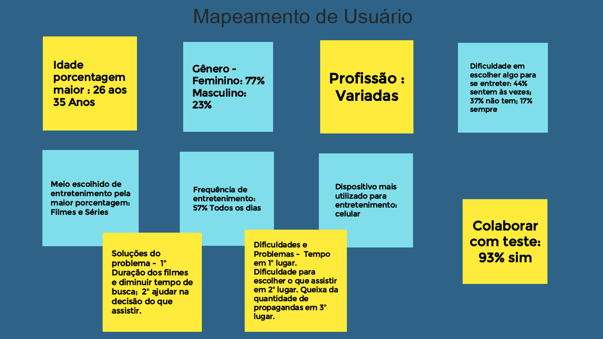
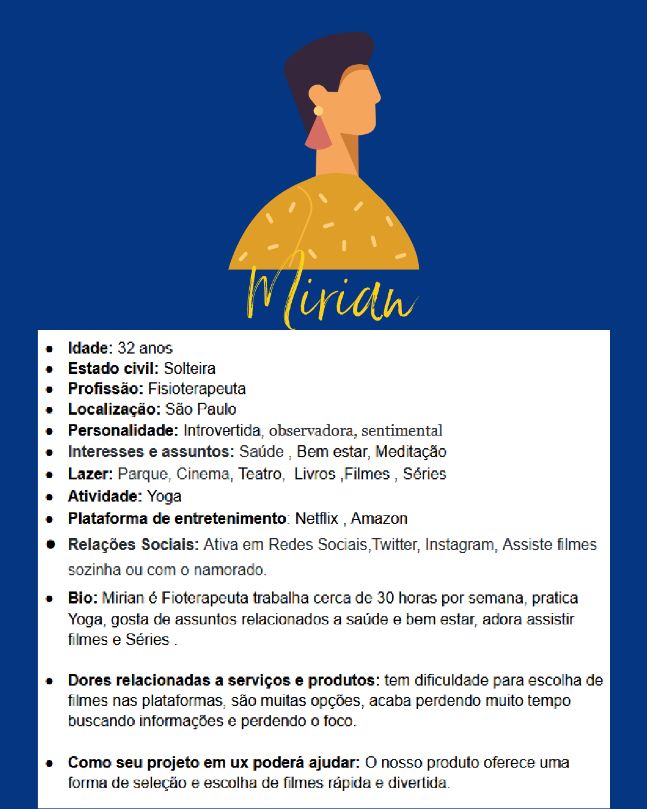
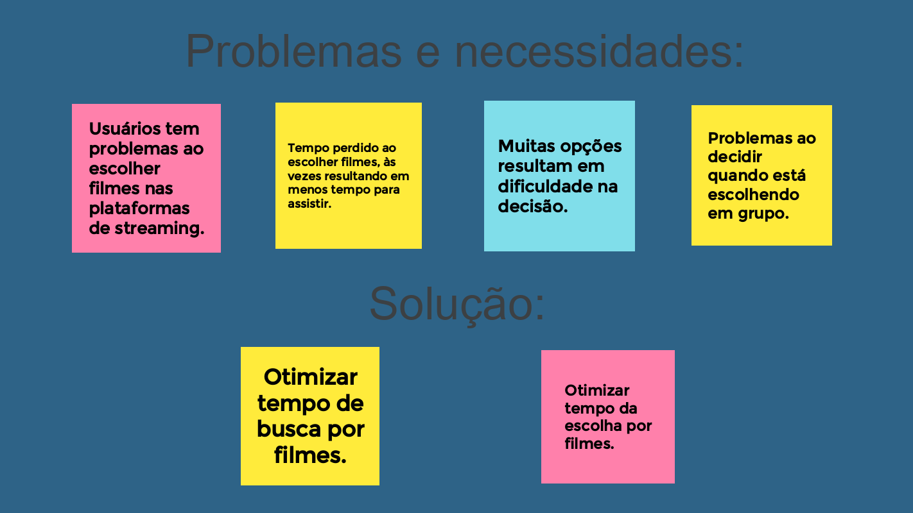
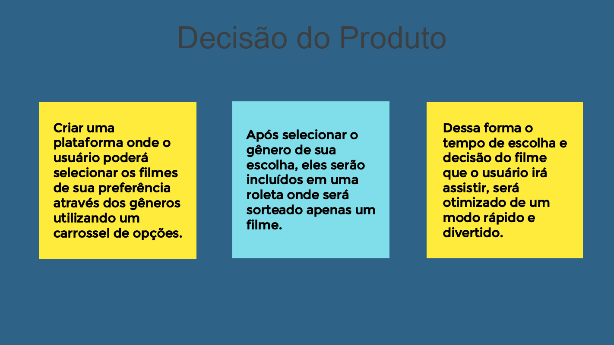
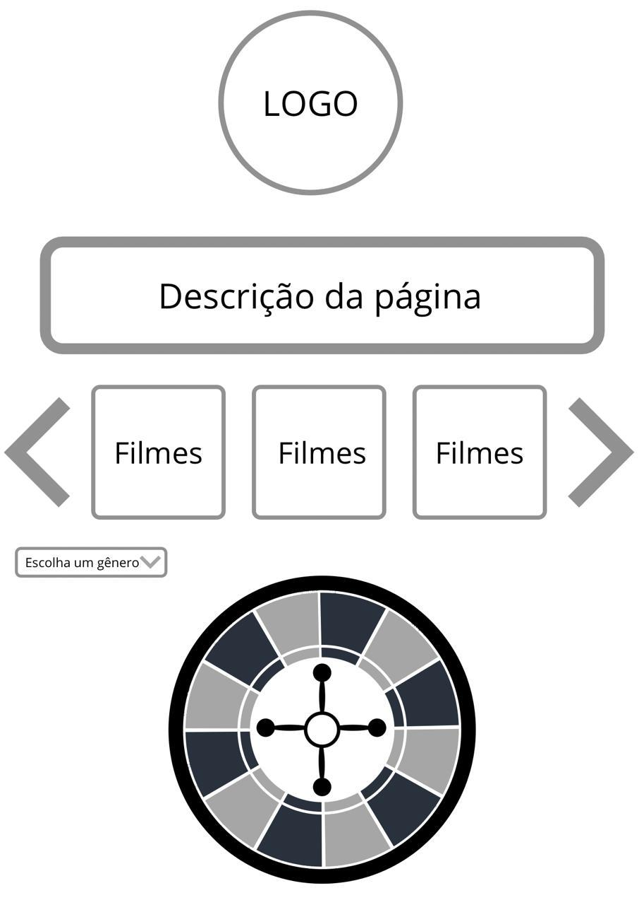
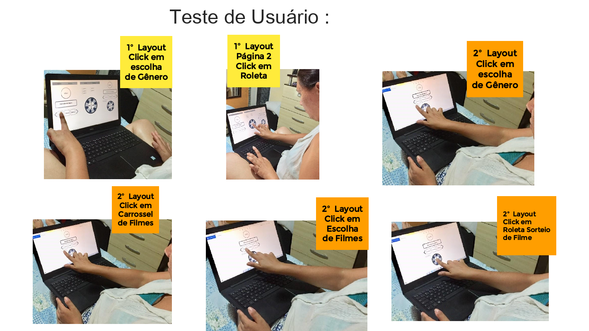
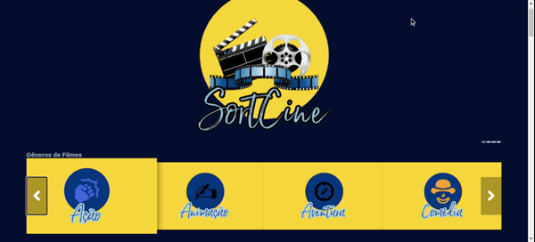

# [SortCine](https://laris28.github.io/SAP005-midterm-hackthon/src/)  :movie_camera:

### Produto: SortCine
Desenvolvemos uma plataforma direcionada às pessoas que gostam de assistir filmes e têm dificuldade com o tempo perdido na escolha do que assistir. Nela os usuários podem escolher um gênero e sortear um filme dentro do gênero, fazendo assim com que se gaste menos tempo.

---

### Protopersona e História de Usuário.
Para este produto criamos as personas Mirian e Carlos, que foram validadas com um formulário do google e que nos orientaram sobre as necessidades mais básicas dos usuários e seus perfis:

---

---

.png)

---

### Interface.
**História do Usuário**
Problemas detectados e necessidades atendidas:

Tendo como referência as necessidades de nossas personas elaboramos as seguintes soluções e decisões:

**Interface**

Desenvolvemos uma aplicação responsiva, no conceito *mobile first*, com base em nossas protopersonas, que em grande parte do tempo utilizam seus celulares para buscar o que assistir, mas que também é possível acessar de vários outros dispositivos.

**Funcionalidades**
Objetivos de interação:
- Filtrar os filmes por gênero
- Poder sortear filmes por gênero

---

### Prototipação
Depois de alguns testes e criação de protótipos de baixa fidelidade à mão, desenvolvemos o protótipo do projeto;

---

### UX
**Experiência do usuário:**
Adotamos um menu carrossel para a lista de gêneros, com poucas palavras e de estilo simples, apenas com ícones nas capas de cada gênero, pensando nas telas reduzidas e aumentando assim a acessibilidade e um sorteio dos filmes por gênero.
Terminadas as telas desenvolvemos uma entrevista para os testes de usabilidade.

---

### UI
**Interface do usuário:**
Tendo validado nosso protótipo e reunido referências visuais só nos restava aplicar estes conceitos nas escolhas do design de interface.

**Definimos uma paleta de cores:**

E finalmente chegamos a cara de nossa aplicação:

---

### Implementações futuras:

- Adicionar uma roleta para o sorteio;
- Direcionar o usúario para a plataforma que o filme está disponível;
- Opção de login para o usúario poder salvar seus sorteios e filmes favoritos;
- Aumentar catálago de filmes;

---
 
###Desenvolvedoras:

**Essa aplicação foi desenvolvida por:**
- [Elis Brasil](https://github.com/Elis-ctrl)
- [Larissa Alborghette](https://github.com/laris28)
- [Letícia Brasileiro](https://github.com/letbrasil)
- [Luana Santana](https://github.com/LuanaGss)
- [Luiza Nunes](https://github.com/aluizada)
- [Roberta Kelly](https://github.com/RobertaKelly)
- [Sara Viana](https://github.com/SaraOhara)

---

### Habilidades Desenvolvidas

- HTML 
- CSS
- JavaScript
- API
- Responsivo 
- Mobile First
- Git 
- Github

